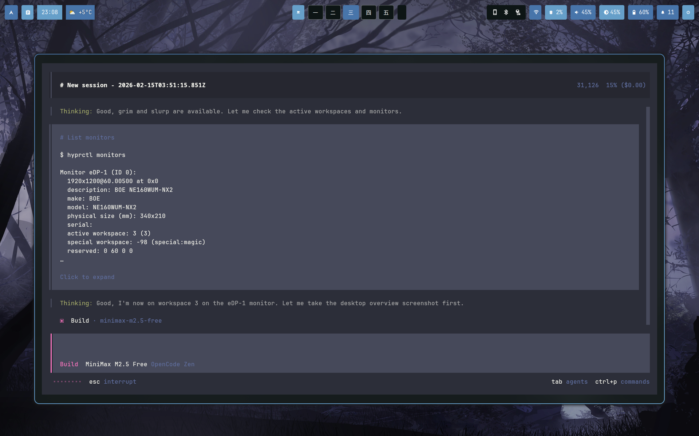
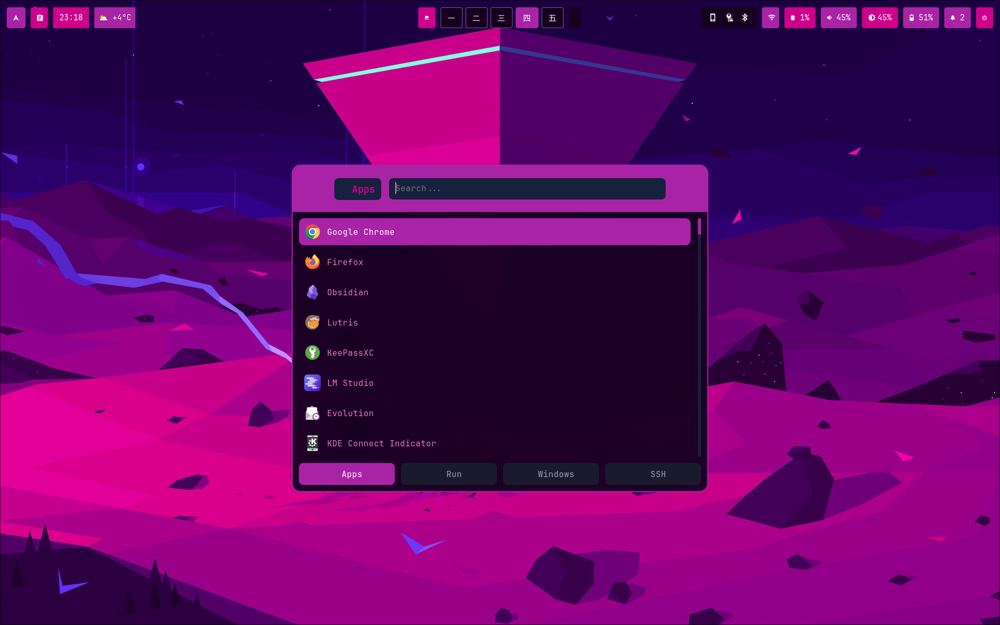
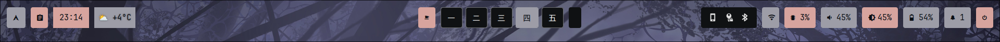
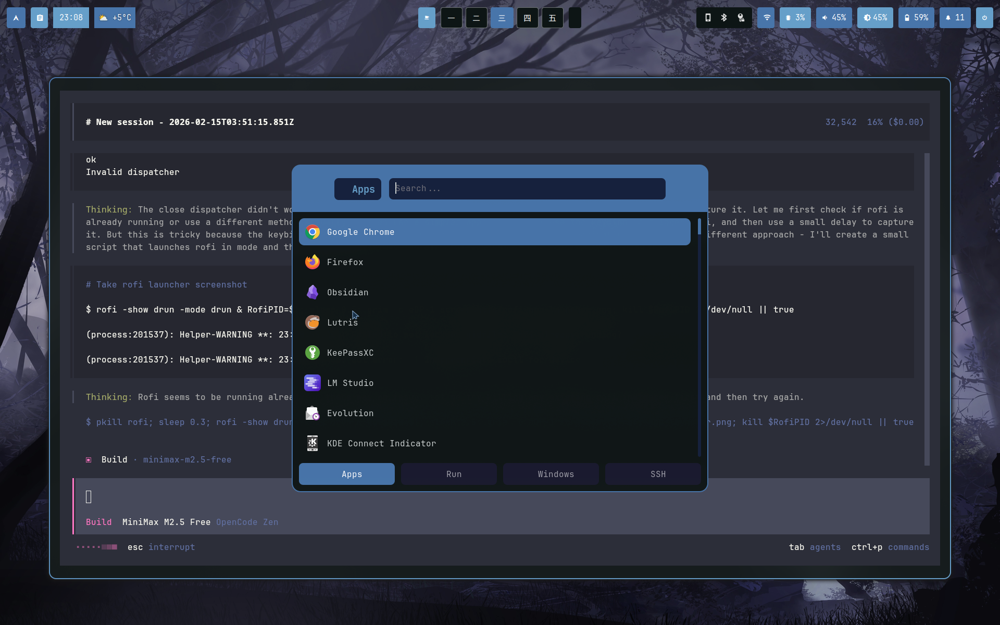
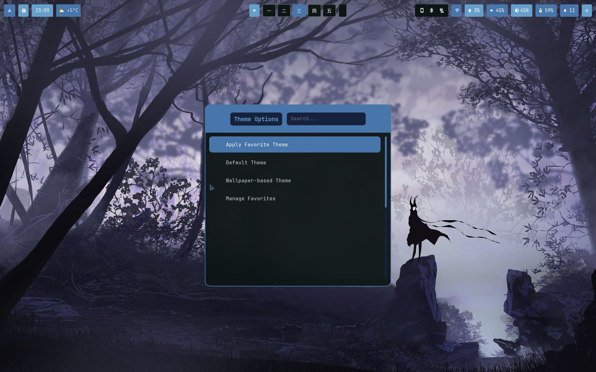
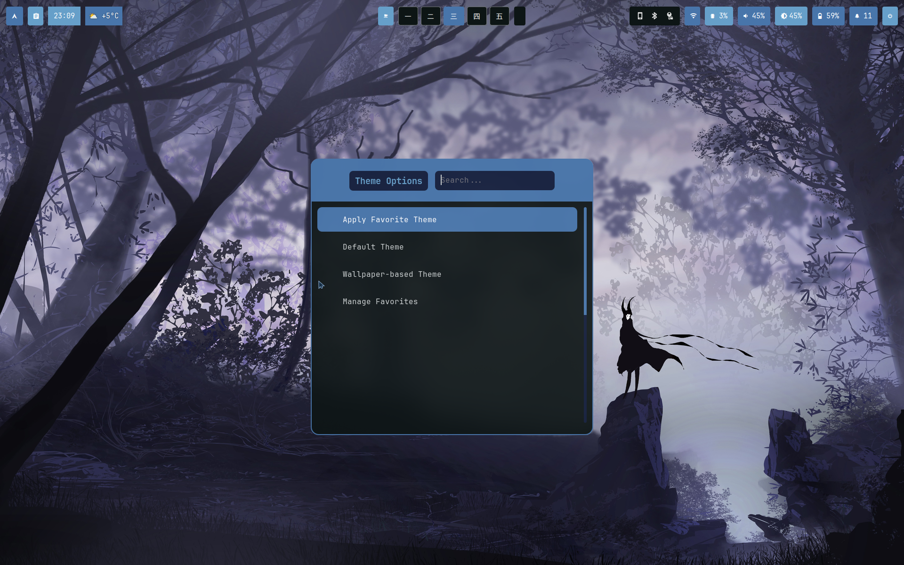
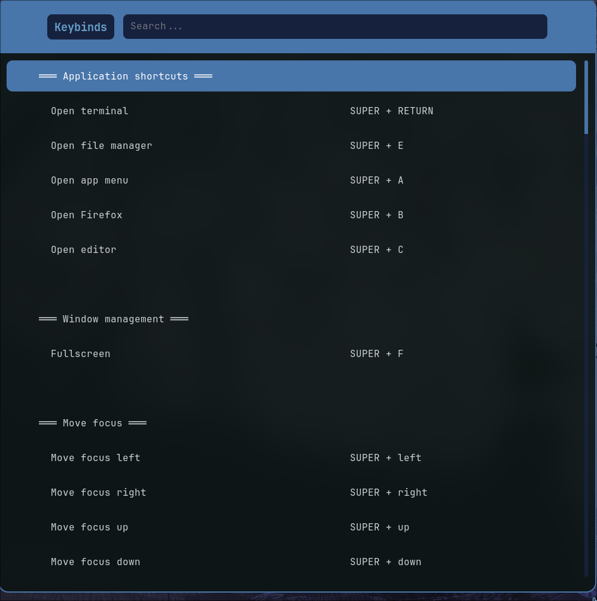
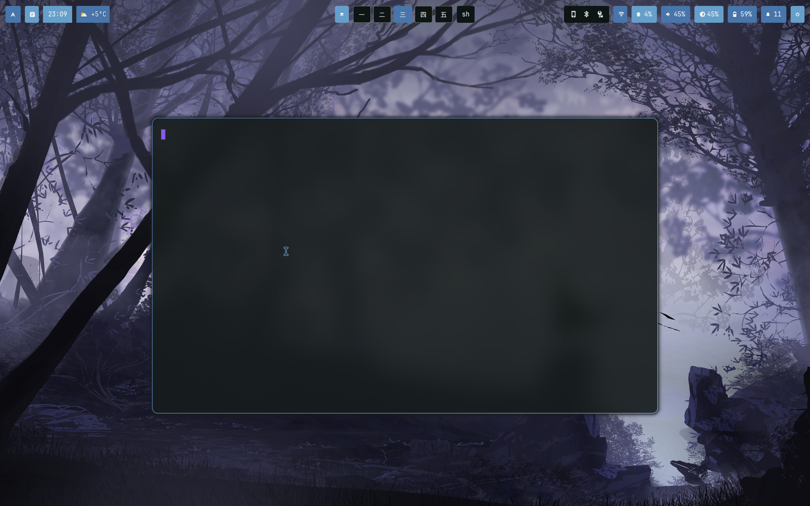
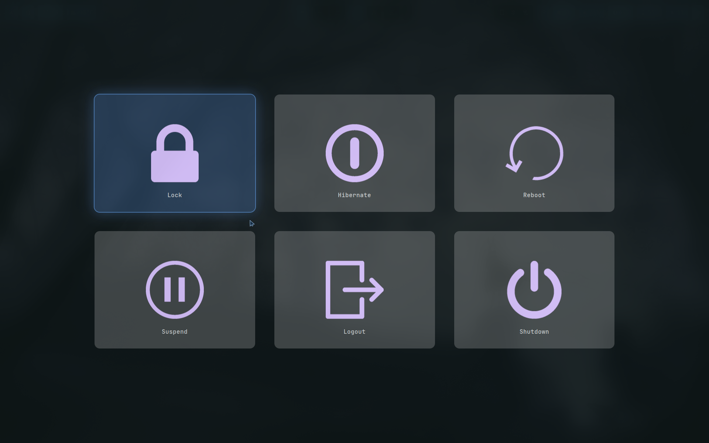
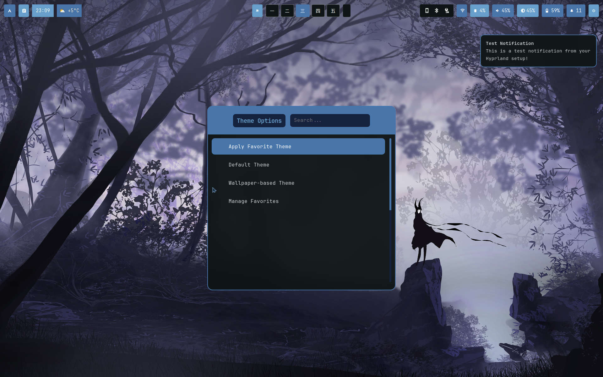

# 💜 peakFlava's Custom Hyprland Dotfiles

A high-performance, visually polished, and fully customized Hyprland environment for Arch Linux. Built with a unique **Deep Purple & Cyan** aesthetic and featuring a smart, dynamic theming engine.

---

## 🎨 Features
- **Dynamic Theme Switcher**: Perfectly sync your entire UI with any wallpaper using Pywal.
- **Video Wallpaper Engine**: Native support for live wallpapers via `mpvpaper`.
- **Intelligent Rofi**: A custom, centered 3-column grid for wallpaper selection.
- **Dashboards**: Integrated BTOP system monitoring that inherits your current theme.
- **Productivity Boost**: Custom auto-resizing functions for Neovim, Tmux, and more.

## 📸 Screenshots

### Desktop & Overview



### Status Bar



### Launchers & Pickers





### Terminal


### System



---

## 🚀 Quick Start

### 1. Clone the repository
```bash
git clone https://github.com/peakFlava/custom-hyprland-dotfiles.git
cd custom-hyprland-dotfiles
```

### 2. Run the installer
```bash
chmod +x install.sh
./install.sh
```

---

## 📚 Documentation
Learn how to get the most out of this setup:

- **[🎥 Video Wallpapers](docs/VIDEO_WALLPAPERS.md)** - Where to find them and how to use them.
- **[🎨 Theme Switcher](docs/THEME_SWITCHER.md)** - Managing your dynamic palettes and favorites.
- **[⌨️ Keybindings](docs/KEYBINDINGS.md)** - Every shortcut you need to know.
- **[🚀 NVIDIA Setup](docs/NVIDIA_SETUP.md)** - Optimization notes for NVIDIA GPU users.
- **[🛠️ Troubleshooting](docs/TROUBLESHOOTING.md)** - Maintenance and recovery tips.

---

## 👤 Author
Developed and maintained by **peakFlava**.

## 📜 License
This project is licensed under the MIT License - see the LICENSE file for details.
